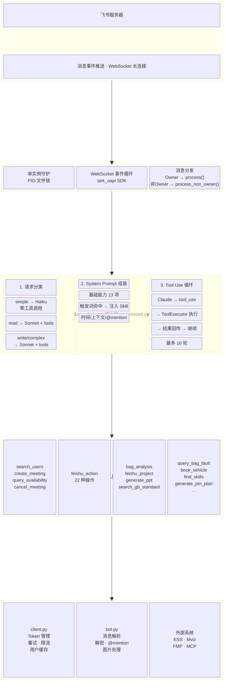
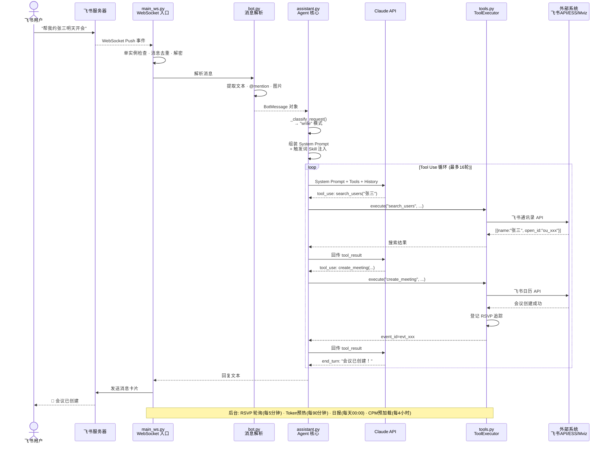
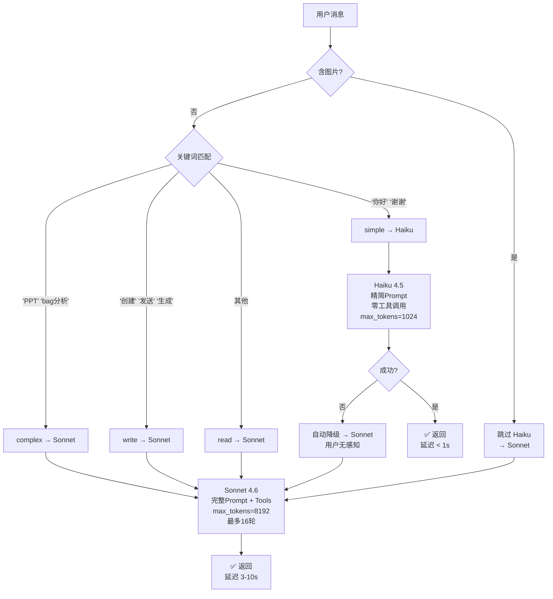

# 飞书 AI Agent 系统设计

> **一个基于 LLM 的模块化企业办公 Agent 框架**
>
> 设计者：李金林（Ryan Li） | 开发周期：2026.03 — 至今 | Claude Code + Python + 飞书开放平台

---

## 一句话概述

这是一个**运行在飞书生态中的 AI Agent 系统**，通过 WebSocket 长连接接收消息，Claude API 作为推理引擎，17 个工具模块完成会议/文档/项目/Bag 分析等办公自动化任务。核心设计理念是 **「Skill 即 Prompt」**——每个 Skill 就是一段注入给 LLM 的指令，不改变代码，只改变行为。

---

## 目录结构

```
feishu-ai-agent/
├── README.md
│
├── agent/                          ← Agent 核心逻辑
│   ├── assistant.py                #   Agent 循环：System Prompt + 路由 + Tool Use Loop
│   ├── tools.py                    #   17 个 Tool JSON Schema + ToolExecutor
│   ├── daily_summary.py            #   每日摘要生成
│   └── group_activity.py           #   群活跃度分级
│
├── feishu/                         ← 飞书平台层
│   ├── main_ws.py                  #   WebSocket 入口 + 单实例守护 + 调度器
│   ├── bot.py                      #   消息解析（解密/富文本/图片/@mention）
│   ├── client.py                   #   飞书 API（Token管理/重试/限流/用户缓存）
│   ├── mcp_client.py               #   飞书项目 MCP 协议客户端
│   ├── message_cache.py            #   SQLite 消息缓存（14天保留）
│   └── fmp.py                      #   FMP 车辆管理 API
│
├── skills/                         ← 4 个 Skill = Prompt + 源码（新增）
│   ├── personal-assistant/         #   个人助理：14 种能力
│   ├── project-bot-customer-service/ # 项目客服：14 项工具
│   ├── cpm/                        #   CPM 岗位助理（纯 Prompt Skill）
│   └── bag-fault-query/            #   故障诊断
│
├── docs/                           ← 设计文档（新增）
│   ├── architecture.md             #   4层架构 + 消息流 + 数据流 + 设计决策
│   ├── system-prompt-design.md     #   分层注入架构 / 19 条格式规则
│   ├── tool-schema-design.md       #   聚合型工具 / 渐进式工作流 / 防呆设计
│   ├── model-routing.md            #   Haiku/Sonnet 三级路由 + 自动降级
│   ├── engineering-mechanisms.md   #   🔥 20 个工程巧思（RSVP/Tiered摘要/跨租户…）
│   ├── production-dialogs.md       #   5 个真实场景 × 完整对话流程
│   └── pitfalls-and-iterations.md  #   10 个月，10 个坑的排查与修复
│
├── scheduler/                      ← 定时任务调度
├── scripts/                        ← 辅助脚本
├── main.py                         ← HTTP 模式入口
├── main_ws.py                      ← WebSocket 模式入口（推荐）
├── requirements.txt                ← Python 依赖
└── .env.example                    ← 配置模板
```

---

## 架构全景



### 消息处理流程



### 模型路由决策



---

## 核心设计决策

| 决策 | 选择 | 理由 |
|------|------|------|
| **通信协议** | WebSocket 长连接 | IM 消息要求实时推送，轮询模式延迟高且浪费资源 |
| **LLM 引擎** | Claude API（Anthropic） | Function Calling 准确率优于同期 GPT-4，中文理解好 |
| **模型路由** | Haiku 处理简单问答，Sonnet 处理需工具调用的任务 | 节约 60% 成本，简单问候秒级响应 |
| **Skill 加载** | 触发词匹配 → 注入 System Prompt | 不改代码，新增 Skill 只需加一个 SKILL.md + 触发词列表 |
| **工具设计** | 少量大工具（feishu_action 含 20+ action）优于大量小工具 | 减少 Claude 的 tool choice 搜索空间 |
| **上下文管理** | 每用户保留最近 6 轮对话 | 平衡记忆连续性与 Token 成本 |
| **单实例守护** | PID 文件 + SIGTERM/SIGKILL | 防止多实例并发导致 Token 文件竞态 |

---

## 技术栈

```
语言：       Python 3.9+
AI 引擎：    Claude API (Anthropic) — Opus/Sonnet/Haiku 三级路由
通信：       WebSocket 长连接 (lark_oapi)
平台：       飞书开放平台（消息/日历/文档/项目/Wiki/云盘）
外部系统：   ESS（车辆数据）、Mviz（可视化）、FMP（车辆管理）
任务调度：   APScheduler（日报/RSVP轮询/Token刷新）
```

---

## Skill 体系一览

| Skill | 定位 | 触发方式 | 工具数 |
|-------|------|----------|--------|
| **personal-assistant** | 个人办公助理 | 基础能力始终加载 | 14 种能力 |
| **project-bot-customer-service** | 项目团队客服 | 独立 Bot 实例 | 14 项工具 |
| **cpm** | CPM 岗位专用 | 触发词命中后注入 | 飞书项目 + 知识库 |
| **bag-fault-query** | 故障诊断 | CLI 调用 / Agent 调用 | 4 步工作流 |

> 详细 Skill 定义见 `skills/`，每个 Skill 文件 = 一段完整的 LLM 指令 Prompt。

---

## 快速开始

### 环境要求
- Python 3.9+
- 飞书开放平台应用（需申请 App ID 和 Secret）
- Anthropic API Key

### 安装依赖

```bash
# 克隆仓库
git clone https://github.com/Ryan-jinlin/feishu-ai-agent.git
cd feishu-ai-agent

# 安装依赖
pip install -r requirements.txt
```

### 配置

1. 复制配置模板：
```bash
cp .env.example .env
```

2. 编辑 `.env` 文件，填入必要配置：
```env
FEISHU_APP_ID=your_app_id
FEISHU_APP_SECRET=your_app_secret
ANTHROPIC_API_KEY=your_api_key
PERSONAL_ASSISTANT_DIR=/path/to/this/repo
```

3. 飞书应用权限配置（需在飞书开放平台开启）：
   - `im:message` - 接收消息
   - `im:message:send_as_bot` - 发送消息
   - `im:chat` - 群组管理
   - `calendar:calendar` - 日历访问
   - `wiki:wiki` - 知识库访问
   - `contact:user.base:readonly` - 用户信息读取

### 运行

```bash
# WebSocket 模式（推荐）
python main_ws.py

# 查看日志
tail -f bot.log
```

---

## 量化效果

| 指标 | 数据 |
|------|------|
| 服务用户数 | ~50 人（团队规模） |
| 累计处理消息 | 10,000+ 条 |
| 平均响应时间 | < 3 秒（含 Claude API 调用） |
| 简单问答（Haiku） | < 1 秒 |
| 系统在线率 | ~99%（除定期维护） |
| 日均 API 调用 | ~200 次 |

---

## 📖 文档阅读路径

- **看架构** → `docs/architecture.md`
- **看代码** → `agent/assistant.py`，从 `process()` 方法入手
- **看 Skill 怎么写** → `skills/`，任意打开一个子目录，SKILL.md 对照看
- **看 System Prompt 设计** → `docs/system-prompt-design.md`
- **看 Tool Schema 设计** → `docs/tool-schema-design.md`
- **看模型路由策略** → `docs/model-routing.md`
- **看工程特色机制（20个）** → `docs/engineering-mechanisms.md`
- **看真实效果** → `docs/production-dialogs.md`
- **看工程成熟度** → `docs/pitfalls-and-iterations.md`

## 工程特色机制速览

| 分类 | 机制 |
|------|------|
| **可靠性** | RSVP追踪 · 单实例守护 · CLI串行锁 · 消息去重 |
| **性能优化** | 模型路由+降级 · 用户缓存预热 · URL缓存 · 群名缓存 |
| **Token管理** | 三层Token刷新 · 启动预热 |
| **智能化** | 跨租户处理 · CPM预加载 · Tiered摘要 · SQLite消息缓存 |
| **安全与权限** | 非Owner隔离 · 撤回安全策略 |
| **边界情况** | 单字解读 · 绝对事实 · 合并转发 · MIME检测 |

> 详见 `docs/engineering-mechanisms.md`

---

## 常见问题

**Q: Bot 无法接收消息？**
A: 检查飞书应用权限是否完整开启，并确认 WebSocket 连接状态。

**Q: 知识库检索无结果？**
A: 确认飞书账号有目标 Wiki 的访问权限。

**Q: 如何调试？**
A: 查看 `bot.log` 日志文件，或设置环境变量 `DEBUG=1` 启用详细日志。

---

## 许可证

MIT License

---

> ⚠️ 本项目依赖 Momenta 企业飞书账号和内部系统，离职后无法实际运行。所有 API Key/Token 均已失效。代码架构、设计模式和 Prompt 工程方案完整可展示。

> *李金林（Ryan Li） | 2026.07*
